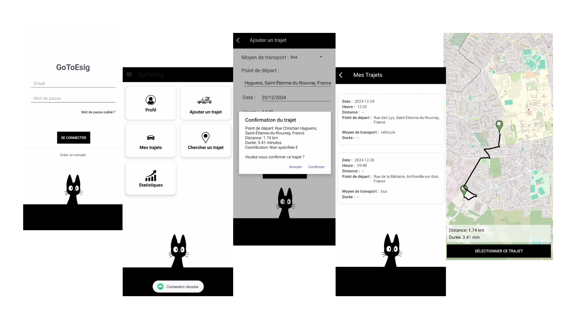
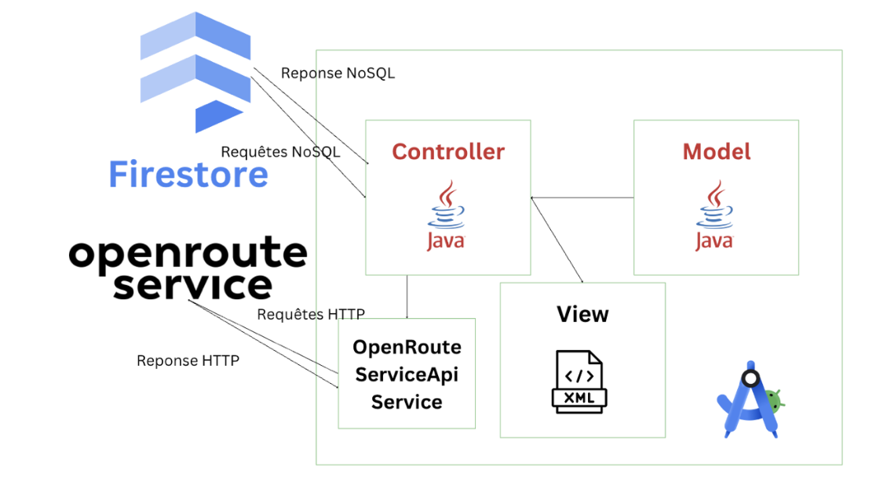

# GotoEsig

**GotoEsig** est une application mobile destinée à faciliter les déplacements des étudiants vers l’ESIGELEC. Elle permet de créer des trajets en covoiturage, à pied, à vélo ou en transport en commun, tout en favorisant l'interaction entre utilisateurs.

**GotoEsig** is a mobile app designed to simplify transportation for students going to ESIGELEC. It allows users to create trips by carpooling, walking, biking, or using public transport while promoting interaction among users.

---

### Interfaces de l'application / App Interfaces

---

### Fonctionnalités principales / Key Features

- Création de compte et connexion des utilisateurs  
  User registration and login  
- Affichage des infos utilisateur (nom, ville, téléphone)  
  Display of user info (name, city, phone)  
- Création de trajets (mode de transport, date, heure, coût)  
  Create trips (transport mode, time, date, cost)  
- Recherche et affichage des trajets sur carte  
  Search and display trips on a map  
- Historique des trajets (en cours et terminés)  
  View current and completed trips  
- Statistiques sur les trajets et revenus générés  
  Show stats on total trips and generated income

---

### Technologies utilisées / Technologies Used

- **Java** (Android & Backend logic)
- **Firebase Firestore** (Realtime NoSQL Database)
- **OpenRouteService API** (Time-Distance Matrix, Directions)
- **Android Studio**
- **XML** (UI layout)

### Architecture logicielle / Software Architecture

---
